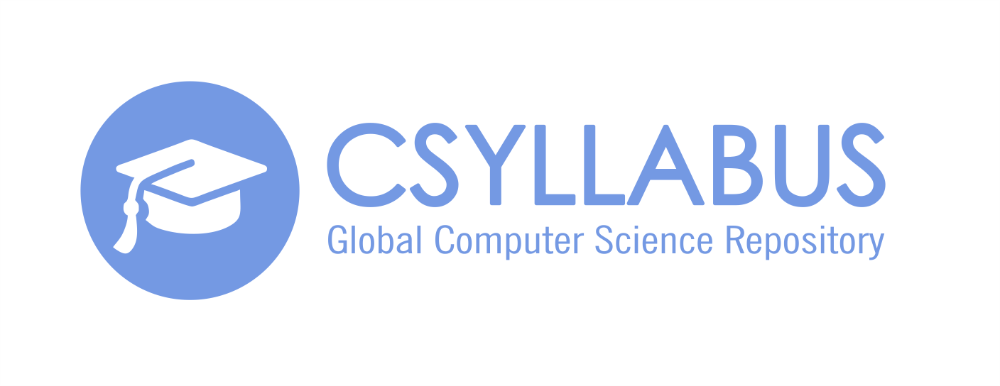

# CSyllabus app = Django REST + Angular 4
Made by team from POLIMI, Italy and FER, Croatia University

## Motivation
 CSyllabus is imagined as a web platform which should ease up process of finding and comparing courses on domestic and foreign faculties.
 It will enable users to discover and compare courses on interactive way through web application.
 This “one click” app will save time and provide very useful information to interested parties.

## Installation
```
export project_name={{ project_name }}
mkvirtualenv $project_name
pip install django
django-admin.py startproject --template=https://github.com/scottwoodall/django-react-template/archive/master.zip $project_name
cd $project_name
```
1. Follow [backend/README.md](backend/README.md)
1. Follow [frontend/README.md](frontend/README.md)

## TODO
1. Build production configs

## Screenshot

