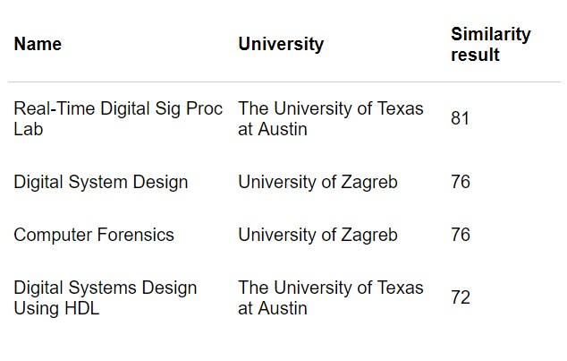
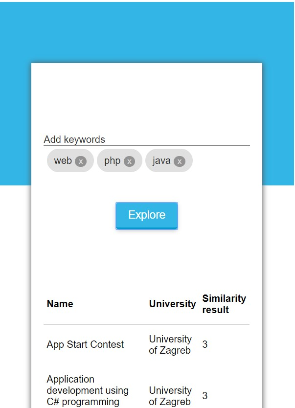
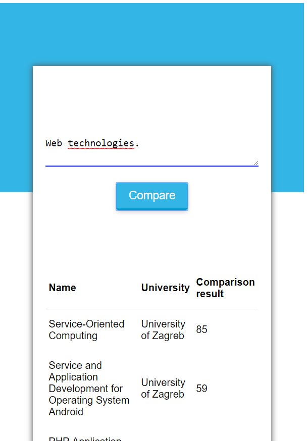

# JS plugins

Currently we are serving three JS plugins which are available to universities which have course data stored in our application.

## How to run our JS plugins

1. Optionally include our js plugins [stylesheet](../csyllabus_js_plugins.css):

```
<link rel="stylesheet" type="text/css" href="csyllabus_js_plugins.css">
```

2. Include our  [js functions file](../csyllabus_js_plugins.js):


### 1. Similar courses

After you have included the js functions file put this html code in your website where you want the plugin to appear:

``` <div id="csyllabus-similar-courses-plugin" data-courseId="1"></div>```

Exchange *data-courseId* value with the id of the course you want to get similar courses for.

Full code example:

``` 
<link rel="stylesheet" type="text/css" href="csyllabus_js_plugins.css">
<div id="csyllabus-similar-courses-plugin" data-courseId="1"></div>
<script src="csyllabus_js_plugins.js"></script>
<script>
    document.onreadystatechange = function () {
        "interactive" === document.readyState && ssc()
    };
</script>
```

End result:

[{:width="200px"}](../similar_courses.html "Similar courses plugin")

### 2. Embedded explorer functionality for a single university

After you have included the js functions file put this html code in your website where you want the plugin to appear:

``` <div id="csyllabus-institution-explorer-plugin" data-universityId="1"></div>```

Exchange *data-universityId* value with the id of the university you want to get similar courses for.

Full code example:

``` 
<link rel="stylesheet" type="text/css" href="csyllabus_js_plugins.css">
<div id="csyllabus-institution-explorer-plugin" data-universityId="1"></div>
<script src="csyllabus_js_plugins.js"></script>
<script>
    document.onreadystatechange = function () {
        "interactive" === document.readyState && serPrepeare()
    };
</script>
```

End result:

[](../university_explorer.html "Similar courses plugin")

### 2. Embedded comparator functionality for a single university

After you have included the js functions file put this html code in your website where you want the plugin to appear:

``` <div id="csyllabus-institution-comparator-plugin" data-universityId="1"> </div>```

Exchange *data-universityId* value with the id of the university you want to get similar courses for.

Full code example:

``` 
<link rel="stylesheet" type="text/css" href="csyllabus_js_plugins.css">
<div id="csyllabus-institution-comparator-plugin" data-universityId="1"> </div>
<script src="csyllabus_js_plugins.js"></script>
<script>
 document.onreadystatechange = function () {
        "interactive" === document.readyState && scrp()
    };
</script>
```

End result:

[](../university_comparator.html "Similar courses plugin")

